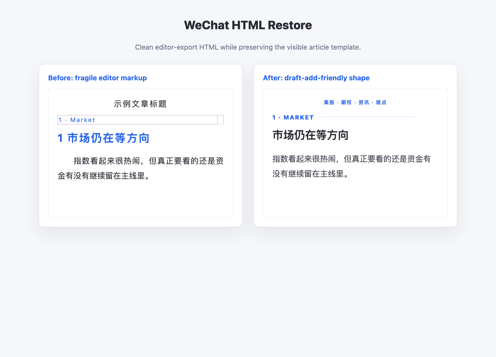

# HTML to WeChat Article Skill 中文文档

这是一个 Codex skill，用来把普通 HTML、编辑器导出的 HTML、或者本地设计好的文章模板，整理成更适合微信公众号文章编辑器和官方 `draft/add` 草稿接口的 HTML。

它的核心目标是：**基本 100% 还原已经确认过的文章视觉效果**。不是套固定模板，也不是重新设计，而是在尽量不改变观感的前提下，把容易在微信里翻车的 DOM 结构清掉。



## 一句话接入 Prompt

把下面这句发给 agent 就能开始：

```text
Install and use the GitHub skill at https://github.com/tonylawx/html-to-wechat-article to convert my HTML into WeChat Official Account article HTML, preserving the approved visual template as close to 100% as possible while keeping it stable for draft/add.
```

如果 skill 已经装好了，可以直接说：

```text
Use $html-to-wechat-article to convert this HTML into a WeChat article for draft/add，尽量 100% 还原原始视觉模板。
```

## 安装

把仓库 clone 到 Codex skills 目录：

```bash
git clone https://github.com/tonylawx/html-to-wechat-article.git ~/.codex/skills/html-to-wechat-article
```

之后重启或刷新 Codex skill 列表，就可以用 `$html-to-wechat-article` 触发。

## 适用场景

- HTML 发到公众号草稿箱后格式丢失。
- 本地浏览器看起来正常，但微信手机预览不对。
- 用 `table` 做小标题装饰，发出去后出现边框。
- 小标题旁边的线条在手机上掉到下一行。
- `h1`、`h2`、`text-align:justify` 导致中文标题或正文假缩进。
- 编辑器导出的 `leaf`、`data-*`、`mpa-font-style` 等属性污染最终 HTML。
- 想保留可见 SEO 关键词行，但去掉隐藏关键词堆砌。

## 设计原则

基本 100% 还原视觉结果，不迷信原始 DOM。

微信公众号会重写一部分 HTML，尤其是编辑器导出的复杂结构、布局表格、标题标签、隐藏块和部分行内样式。这个 skill 会指导 agent 先看清楚“最终应该长什么样”，然后只改那些会破坏微信渲染稳定性的结构。颜色、字号、间距、图片比例、小标题层级、CTA 和二维码区域，都应该尽量贴近原版。

## Agent-First 工作流

这个 skill 不依赖 Python，也不要求任何运行时。正常使用时，让 agent 直接读 HTML、改 HTML、再预览确认。

推荐流程：

1. 打开原始 HTML 或截图，确认已经认可的视觉效果，把它当成接近 100% 还原目标。
2. 提炼设计契约：顶部关键词、头图、小标题、正文、关注卡片、二维码、免责声明等。
3. 直接编辑 HTML，保留真正影响视觉的颜色、字号、间距、图片尺寸和行内样式。
4. 清掉脆弱结构，例如布局表格、编辑器属性、隐藏块、过度 `letter-spacing`。
5. 本地重新打开 HTML，对比原版。
6. 如果要走微信官方 `draft/add`，优先使用已稳定化的 HTML。

## 常见清洗规则

删除编辑器属性：

- `leaf`
- `mpa-font-style`
- 不必要的 `data-*`

删除隐藏关键词堆砌：

- `display:none`
- `visibility:hidden`
- `opacity:0`
- `font-size:0`

替换布局表格：

- `table` / `tbody` / `tr` 改成 `section` 或 `div`
- 装饰用 `td` 改成 `span`
- 真实数据表格可以保留

稳定标题：

- 如果 `h1` / `h2` 在微信预览里异常，就改成带样式的 `p`
- 长中文标题不要和装饰线放在同一行
- 去掉标题里的数字前缀时，要确认蓝色编号或标签已经单独展示

稳定正文：

- 视情况把 `text-align:justify` 改成 `text-align:left`
- 把 `text-indent` 改成 `0`
- 过大的中文 `letter-spacing` 改成 `0` 或约 `1px`
- 容器上保留或补充 `box-sizing:border-box`

## 小标题推荐写法

不要用表格做标签和横线：

```html
<table style="width:100%;">
  <tr>
    <td style="color:#2763e9;">1 · Market</td>
    <td style="border-bottom:1px solid #d7e2ff;"> </td>
  </tr>
</table>
<h2 style="letter-spacing:2px;text-align:justify;">1 市场仍在等方向</h2>
```

推荐改成：

```html
<section style="margin:0 0 12px 0;padding:0;text-align:left;line-height:1.2;border:0;">
  <span style="display:inline-block;vertical-align:middle;color:#2763e9;font-size:12px;font-weight:850;letter-spacing:0.12em;line-height:1.2;text-transform:uppercase;border:0;">1 · Market</span>
  <span style="display:inline-block;vertical-align:middle;width:56%;height:1px;margin:0 0 3px 10px;background:#d7e2ff;line-height:1px;font-size:0;border:0;"> </span>
</section>
<p style="margin:0 0 16px 0;color:#2a2a34;font-size:22px;line-height:1.45;font-weight:850;text-align:left;letter-spacing:0;">市场仍在等方向</p>
```

这样编号和蓝线比较稳定，长标题也不会把线挤到奇怪的位置。

## 可选脚本

仓库里带了一个可选 Python 脚本，适合批量处理或快速查看清洗报告：

```bash
python3 scripts/restore_wechat_html.py examples/before.html -o examples/after.generated.html --report
```

注意：这个脚本不是必须的。skill 的主流程是 agent 直接处理 HTML。

脚本不会调用微信 API，不处理公众号凭证，也不会上传图片。

## 文件说明

- `SKILL.md`：agent 使用说明。
- `README.md`：英文文档。
- `README.zh-CN.md`：中文文档。
- `scripts/restore_wechat_html.py`：可选批处理脚本。
- `examples/before.html`：不稳定示例。
- `examples/after.html`：清洗后示例。
- `assets/example-screenshot.png`：示例图。

## License

MIT
